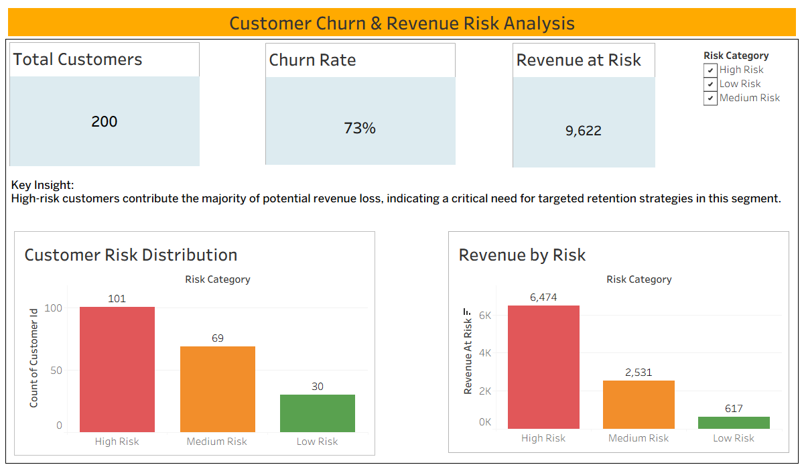

Customer Churn & Revenue Risk Intelligence Dashboard

Project Overview

This project presents an interactive Tableau dashboard designed to analyze customer churn patterns and quantify potential revenue risk. It helps businesses identify high-risk customers and take proactive retention actions.

 Dashboard Preview
 

Key Objectives

Analyze customer churn behavior
Segment customers into High, Medium, and Low risk
Identify revenue exposure due to potential churn
Enable data-driven decision making

 Dashboard Features
 
 Total Customers KPI
 Churn Rate KPI
 Revenue at Risk KPI
 Customer Risk Distribution
 Revenue by Risk
 Interactive Risk Category Filter

 Key Insights
 
 High-risk customers contribute the majority of revenue risk
 Churn rate indicates urgent need for retention strategies
 Risk segmentation helps prioritize business decisions

 Tools Used
 
 Tableau
 Excel / CSV Dataset

 Business Impact
 
 This dashboard enables organizations to:
 Reduce churn
 Protect high-value customers
 Minimize revenue loss
